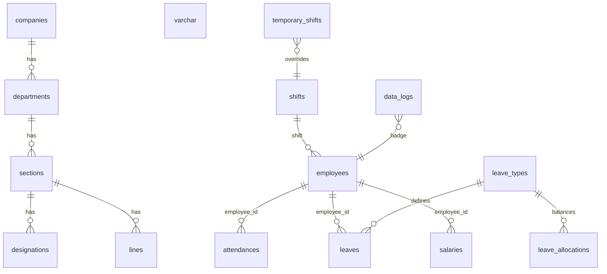
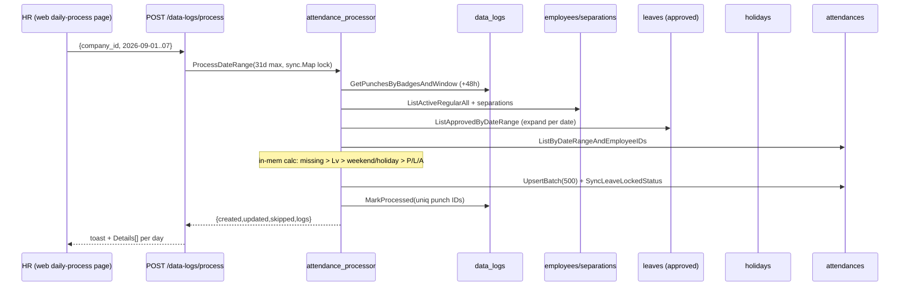

# PeopleHub — Enterprise HR, Attendance & Payroll Platform

> **Industry:** Bangladeshi Garment & Factory Industries  
> **Type:** Monolithic — Go Backend + Next.js Frontend + PostgreSQL  
> **Version:** 1.1.0 &nbsp;|&nbsp; **Last Updated:** 2026-09-02  
> **Repo:** `PeopleHub` &nbsp;|&nbsp; **Task Doc:** `task/PeopleHub.md`

<style>
.ph-hero{background:linear-gradient(135deg,#0f766e 0%,#0e7490 45%,#1d4ed8 100%);color:#fff;padding:28px 24px;border-radius:16px;margin:16px 0 20px 0}
.ph-hero h1{margin:0 0 6px 0;font-size:28px;letter-spacing:-0.02em}
.ph-hero p{margin:0;opacity:.92;line-height:1.5}
.ph-badges{display:flex;flex-wrap:wrap;gap:8px;margin-top:12px}
.ph-badge{background:rgba(255,255,255,.14);border:1px solid rgba(255,255,255,.22);padding:5px 10px;border-radius:999px;font-size:12px;backdrop-filter:blur(6px)}
.ph-grid{display:grid;grid-template-columns:repeat(12,1fr);gap:14px;margin:16px 0}
.ph-card{grid-column:span 6;background:#fff;border:1px solid #e5e7eb;border-radius:14px;padding:16px}
.ph-card h3{margin:0 0 6px 0;font-size:14px;letter-spacing:.02em;text-transform:uppercase;color:#0f766e}
.ph-card p{margin:0;color:#374151;font-size:13px;line-height:1.5}
.ph-kpi{display:grid;grid-template-columns:repeat(4,1fr);gap:10px;margin:14px 0}
.ph-kpi div{background:#f8fafc;border:1px solid #e2e8f0;border-radius:12px;padding:12px;text-align:center}
.ph-kpi b{display:block;font-size:22px;color:#0f172a}
.ph-kpi span{font-size:11px;letter-spacing:.06em;text-transform:uppercase;color:#64748b}
.ph-toc{background:#ffffff;border:1px solid #e5e7eb;border-radius:12px;padding:14px 16px;margin:16px 0}
.ph-toc a{color:#0e7490;text-decoration:none}
.ph-toc a:hover{text-decoration:underline}
.ph-resp{overflow-x:auto}
.ph-resp table{width:100%;border-collapse:collapse}
.ph-break{display:grid;grid-template-columns:repeat(4,1fr);gap:10px}
.ph-break div{border:1px solid #e5e7eb;border-radius:12px;padding:12px;background:#fff}
.ph-break b{font-size:13px}
@media (max-width: 1024px){ .ph-card{grid-column:span 6} .ph-kpi{grid-template-columns:repeat(2,1fr)} .ph-break{grid-template-columns:repeat(2,1fr)} }
@media (max-width: 640px){ .ph-hero{padding:20px 16px} .ph-hero h1{font-size:22px} .ph-card{grid-column:span 12} .ph-kpi{grid-template-columns:repeat(2,1fr)} .ph-break{grid-template-columns:1fr} }
</style>

<div class="ph-hero">

# PeopleHub

**Complete HR Lifecycle • ZKTeco Biometric Attendance • Leave & Payroll Automation**

<p>Single-source knowledge base for developers, designers and operators. Covers architecture, 42-table schema, 175+ APIs, 85+ pages and the production-grade responsive design system. Mobile-first, accessible, and built for real factory floors.</p>

<div class="ph-badges">
<span class="ph-badge">Go 1.26 • Gin 1.12 • GORM 1.31</span>
<span class="ph-badge">PostgreSQL 16</span>
<span class="ph-badge">Next.js 16 • React 19 • Tailwind v4</span>
<span class="ph-badge">shadcn/ui • Radix • TanStack Table v8</span>
<span class="ph-badge">JWT HS256 • bcrypt cost 12</span>
<span class="ph-badge">Docker Compose • 3 services</span>
</div>
</div>

<div class="ph-kpi">
<div><b>42</b><span>Tables • UUID PK • Soft Delete</span></div>
<div><b>175+</b><span>REST Endpoints • /api/v1</span></div>
<div><b>85+</b><span>App Router Pages</span></div>
<div><b>100%</b><span>Mobile Responsive</span></div>
</div>

<div class="ph-toc">

**Contents** — [1 Overview](#1-overview) • [2 Tech Stack](#2-tech-stack) • [3 Architecture](#3-architecture) • [4 Directory](#4-directory-structure) • [5 Backend Layers](#5-backend-architecture) • [6 Frontend](#6-frontend-architecture) • [7 Database](#7-database-schema) • [8 API Inventory](#8-api-inventory) • [9 Data Flows](#9-core-data-flows) • [10 Responsive Design](#10-responsive-design-system) • [11 UI System](#11-ui--component-system) • [12 Pages Map](#12-pages--routes-map) • [13 Auth & RBAC](#13-auth--rbac) • [14 Payroll Rules](#14-payroll--business-rules) • [15 Leave Lock](#15-leave-lock--Lv-design) • [16 Build & Deploy](#16-build-run--deploy) • [17 Standards](#17-standards) • [18 Known Issues](#18-known-issues)

</div>

---

## 1. Overview

**PeopleHub** is an enterprise HRM for high-headcount factories. It ties **employee master**, **ZKTeco attendance**, **shift/leave** and **payroll** into one monolith that runs on-prem (Windows + ZKTeco MCP) or via Docker.

**Goals**
- One business key per employee (`employee_id` varchar) across attendance, leave and payroll
- One tap daily-process that turns raw punches into `P / L / A / H / W / Holiday / Lv` with leave-lock
- One payroll run that is idle-safe, indexed and explainable (500 BDT perfect-attendance bonus)
- One UI that works on a 320px phone on the shop floor and a 1440px HR desk

**Non-goals (v1)**
- Linux-native ZKTeco driver (Windows + ACE.OLEDB.12.0 required)
- Real foreign keys in DB (app-level integrity, see §7.9)
- Multi-tenant row-level isolation beyond `company_id` scoping

---

## 2. Tech Stack

| Layer | Technology | Version | Notes |
|-------|------------|---------|-------|
| **Language** | Go | 1.26.2 | `go.mod` |
| **Web** | Gin | 1.12.0 | `gin-contrib/cors`, `gin-swagger` |
| **ORM** | GORM | 1.31.2 + `postgres` 1.6.0 | `DisableForeignKeyConstraintWhenMigrating: true` |
| **DB** | PostgreSQL | 16 | `gen_random_uuid()`, `deleted_at` soft delete |
| **Auth** | `golang-jwt/jwt` | v5.3.1 | HS256, 15m access / 7d refresh |
| **Crypto** | `golang.org/x/crypto` | — | bcrypt cost **12**, `password_histories` |
| **Docs** | Swaggo | 1.16.6 | `docs/docs.go` Swagger 2.0 |
| **Frontend** | Next.js App Router | 16.2.10 | React **19.2.4** |
| **Styling** | Tailwind | v4 | `postcss` / no `tailwind.config` file |
| **UI** | shadcn/ui + Radix | — | 129 components vendored in `components/ui` |
| **Tables** | TanStack Table | v8 | `DataTable` 528 lines + `dnd-kit` |
| **Charts** | Recharts | 3.8.0 | Dashboard & analytics |
| **HTTP** | Axios | 1.18.1 | `axios-instance.ts` + 401 refresh |
| **Biometric** | ZKTeco ADODB | ACE.OLEDB.12.0 | **Windows PowerShell** reader |
| **Deploy** | Docker & Compose | — | `web/Dockerfile` multi-stage, Compose 3 services |

---

## 3. Architecture

```mermaid
flowchart TB
  subgraph Client[Next.js 16 • App Router]
    A[Pages 85+ • "use client"] --> B[lib/api.ts 41 clients]
    B --> C[axios-instance • Bearer + 401 refresh]
    A --> D[shadcn/ui • Tailwind v4 • DataTable • Forms]
  end
  subgraph Server[Go + Gin]
    E[Gin Router • CORS • Logger • Audit] --> F[Auth Middleware • JWT HS256]
    F --> G[Handlers 35 files • DTO + Swagger • Status Codes]
    G --> H[Services 8 • auth, attendance_processor, salary, mdb_reader]
    H --> I[Repositories 28 • GORM + Raw SQL + ? placeholders]
    I --> J[(PostgreSQL 16 • 42 tables • UUID PK)]
  end
  K[(ZKTeco att2000.mdb • CHECKINOUT)] -- PowerShell ADODB --> L[data_logs]
  L -- daily-process / ProcessDateRange --> J
  C <--> E
```

**Layered (Clean-ish)**
```
HTTP (Gin) → Handlers (DTO/bind/status) → Services (biz logic) → Repositories (GORM/Raw SQL) → Models (tags) → Postgres
```
*No strict Use-Case/Domain layer. Salary calc lives in `service/salary.go` + handler orchestration — acceptable at current scale.*

**DI** — Manual wiring in `internal/server/server.go` (DB → JWT → 28 repos → 8 services → 35 handlers → `routes.Setup`). No Wire/Dig.

**Middleware order:** `CORS → Logger → Audit (POST/PUT/PATCH/DELETE → audit_logs async) → Auth (Bearer, sets user_id/email/roles/permissions) → RequirePermission/RequireRole (opt-in)`

---

## 4. Directory Structure

```
PeopleHub/
├── .env / .env.example / .env.local / .env.production
├── docker-compose.yml                # 3 services (when used)
├── Dockerfile                        # Backend (when added) + web/Dockerfile (Next standalone)
├── go.mod / go.sum
├── cmd/
│   ├── server/main.go                # Entry + Swagger annotations + graceful shutdown
│   ├── seed/...                      # geo, organization, leave, employee, superadmin, postcodes
│   └── migrate-*/...                 # empinfo, leaves post-migrations
├── docs/                             # gen by swag init (docs.go / swagger.json/.yaml)
├── backups/ & uploads/
├── internal/
│   ├── auth/{jwt,password}.go
│   ├── config/config.go              # env loader, GetDSN, defaults (shakil/123456 → change in prod)
│   ├── database/postgres.go          # Connect + AutoMigrate(42) + 12 ALTER varchar(50) + 20+ indexes + pool 25/10
│   ├── handlers/ (35)                # attendance, data_log, daily_custom_summary, employee_*, leave, salary*, etc.
│   ├── middleware/{auth,audit,cors,logger,permission}.go
│   ├── models/ (42)                  # see §7
│   ├── repository/ (28)              # one per aggregate, WithTx, Preload, Raw SQL with ?
│   ├── routes/routes.go              # ~701 lines, ALL groups under /api/v1
│   ├── server/server.go              # manual DI
│   └── service/ (8)                  # auth, attendance_processor, data_log, mdb_reader, salary, separation, user, notifications
├── web/
│   ├── app/                          # App Router — (auth) + (root) 85+ pages (§12)
│   ├── components/{ui,table,form,layout,data}
│   ├── lib/{api,axios-instance,crud-factory,auth,error-handler,utils}.ts
│   ├── app/globals.css               # Tailwind v4 + shadcn vars
│   ├── next.config.ts                # output standalone, basePath env
│   └── package.json                  # Next 16, React 19, Radix, Recharts, RHF+Zod
└── task/
    ├── AGENTS.md                     # legacy knowledge base (1104 lines)
    └── PeopleHub.md                  # ← this file (single responsive source of truth)
```

---

## 5. Backend Architecture

**Handlers** — One file per domain, `CreateXxxRequest` DTOs, `c.ShouldBindJSON`, `utils.ParsePagination`, `utils.NewPaginatedResponse`, proper codes (`201/200/400/401/403/404/409/500`), `gin.H{"error":...}` swallowed never, Swaggo godoc on every method.

**Repositories** — `NewXxxRepository(db *gorm.DB)`, `WithTx(tx)`, `Create/FindByID/List/Update/Delete`, `Preload()` for relations, `Where("col = ?", val)` parameterized (no concat), raw SQL only for `SummaryByGroup` etc. with whitelisted `GROUP BY`.

**Services** — Auth (login/register/refresh/lockout), `attendance_processor` (bulk load → in-mem calc → batch upsert), `mdb_reader` (PowerShell ACE.OLEDB), `salary` (per-employee calc), `separation`, `user`, `notification_checker`.

**Routes** — All under `api.Group("/api/v1")`. `GET /health` public, `/auth/*` public, everything else `Use(AuthMiddleware)`, destructive `Use(RequireRole("super_admin"))`.

---

## 6. Frontend Architecture

| Concern | Choice | File |
|---------|--------|------|
| **Framework** | Next.js 16 App Router, mostly `"use client"` | `web/app/layout.tsx:1` `web/app/(root)/layout.tsx` |
| **State** | Local `useState/useEffect`, no global store | each `page.tsx` |
| **Data** | `lib/api.ts` 41 clients → `axios-instance.ts` (Bearer, 401 refresh + retry, `localStorage` + `auth_token` cookie) | `web/lib/api.ts:1` `web/lib/axios-instance.ts:1` |
| **Tables** | `<DataTable>` (TanStack v8 + dnd-kit, 528 lines) + `SimpleTable` | `web/components/table/data-table.tsx` |
| **Forms** | React Hook Form + `@hookform/resolvers` + Zod | `web/components/form/*` (`EmployeeForm` 701 lines) |
| **UI** | Tailwind v4, `cn()` (`clsx`+`twMerge`), shadcn/ui 129, Lucide | `web/components/ui/*` `web/lib/utils.ts:cn` |
| **Layout** | AppSidebar (collapsed groups `NavMain/NavGroup`), SiteHeader, SearchDialog | `web/components/layout/*` |
| **Charts** | Recharts | `web/app/(root)/dashboard/page.tsx`, analytics |
| **Fonts** | `Geist`, `Geist_Mono`, `Playfair_Display` | `web/app/layout.tsx:2` |

---

## 7. Database Schema

**42 tables • UUID PK `gen_random_uuid()` • `deleted_at` soft delete • `created_by/updated_by/deleted_by` UUID audit • No FK constraints** (`DisableForeignKeyConstraintWhenMigrating`)

<div class="ph-resp">

### 7.1 Auth & Identity (12)

| Table | Purpose | Key Fields |
|-------|---------|------------|
| `users` | System users | `email` unique, `password_hash`, `status`, `mfa_enabled`, `failed_attempts`, `locked_at`, `force_password_change` |
| `roles` | Role defs | `company_id`, `name`, `is_system` |
| `permissions` | Perm defs | `resource`, `action` |
| `user_roles` | M2M | `user_id`, `role_id` |
| `role_permissions` | M2M | `role_id`, `permission_id` |
| `sessions` | Active sessions | `ip_address inet`, `browser`, `os`, `expires_at` |
| `refresh_tokens` | Refresh store | `token_hash` unique, `expires_at`, `revoked_at` |
| `login_histories` | Login audit | `status`, `ip`, `browser` |
| `password_histories` | N prev hashes | `password_hash` |
| `password_resets` | Reset tokens | `token_hash` unique |
| `email_verifications` | Verify tokens | `token_hash` |
| `audit_logs` | Change audit | `action`, `resource`, `old_value/new_value jsonb` |

### 7.2 Organization & Geo (11)

| Table | Key | Parent |
|-------|-----|--------|
| `companies` | `company_name_en/bn`, `slug` unique, `settings jsonb` | — |
| `departments` | `company_id` | companies |
| `sections` | `department_id` | departments |
| `designations` | `section_id` | sections |
| `lines` | `section_id` | sections |
| `groups`, `floors` | `name` | — |
| `divisions` | `name`, `name_bn` | — |
| `districts` | `division_id` | divisions |
| `upazilas` | `district_id` | districts |
| `unions` | `upazila_id` | upazilas |
| `post_offices` | `district_id` | districts |

### 7.3 HR Core (4)

| Table | Key Fields |
|-------|------------|
| `employees` | `employee_id` **varchar(50)** unique business key (not PK), `punch_number` unique, `name_en/bn`, `father/mother`, `dob`, `gender`, `blood_group`, `marital/religion`, `present/permanent_address`, `department/section/designation/line/group/floor`, `shift_id`, `reports_to`, `present+permanent` division/district/upazila/union, `gross_salary`, `house_rent=core-basic`, `food 1250`, `transport 450`, `medical 750`, `status active`, `over_time_status` |
| `shifts` | `name`, `shift_type day`, `start_time HH:MM`, `end_time HH:MM`, `late_grace_minutes`, `weekend_days "Fri,Sat"` |
| `temporary_shifts` | `employee_id`, `shift_id`, `company_id`, `date` |
| `requirements` | `position`, `department_id`, `vacancies`, `priority Medium` |

Address: `present_*_id` → divisions/districts/upazilas/unions, same for `permanent_*`.

### 7.4 Attendance & Biometric (2)

| Table | Fields |
|-------|--------|
| `data_logs` | `badge_number`, `punch_time timestamp`, `punch_type I/O`, `device_id/sn`, `date date`, `processed bool` |
| `attendances` | `employee_id` **varchar(50)**, `company_id`, `shift_id`, `date date`, `check_in/out timestamp` (migrated from varchar), `total_hours varchar(5)`, `over_time varchar(5)`, `status` (`present/late/absent/on_leave/weekend/half_day/holiday`), `late_minutes`, `punch_number` — **Lv short code in exports** `statusMap` |

### 7.5 Leave (3)

| Table | Fields |
|-------|--------|
| `leave_types` | `company_id`, `name`, `code`, `total_days`, `carry_forward_days`, `applicable_gender All` |
| `leave_allocations` | `employee_id` varchar, `leave_type_id`, `year`, `total_days`, `used_days`, `pending_days` — **uniq `(emp,type,year)`** |
| `leaves` | `company_id`, `employee_id` varchar, `leave_type_id`, `from_date/to_date date`, `total_days`, `reason`, `status` pending/approved/rejected/cancelled, `approved_by/at`, `rejection_reason` |

### 7.6 Payroll (2) + Ledger

| Table | Fields |
|-------|--------|
| `salaries` | `company_id`, `employee_id` varchar, `month/year`, `basic = core/1.5`, `house_rent = core-basic`, `medical 750`, `gross`, `pf/tax 0`, `absent_deduction = gross/total_days*absent`, `ot_rate = basic/total_days/8`, `ot_amount`, `attendance_bonus 500`, `net_salary`, `present/absent/late/leave/weekend` counts — **uniq `(comp,emp,month,year)`** |
| `salary_increments` | `previous_gross`, `increment_amount`, `new_gross`, `effective_date`, `status` |
| `ot_early_exit_deductions` | `company_id`, `employee_id`, `date`, `shift_start/end`, `expected_hours`, `worked_hours`, `shortfall = expected-worked`, `month/year` — ledger, excluded from payroll weekends/holidays/`on_leave` |

### 7.7 HR Ops (8)

| Table | Purpose |
|-------|---------|
| `separations` | Resign/Lefty/Close, `type`, `date`, `status` |
| `id_cards` | `card_no`, `expiry`, `status` |
| `punishments` | `type`, `amount`, `reason` |
| `missing_attendances` | Manual override **highest priority** (employee+date) before ZKTeco |
| `daily_schedules` | `schedule_type`, `start/end`, `remarks` |
| `night_bills` | `night_hours`, `rate`, `amount` |
| `tiffin_bills` | `amount`, `month/year` |
| `system_settings` | `key` unique, `value` |

</div>

**Indexes (20+, auto `IF NOT EXISTS`)** — `salaries(comp,year,month)`, `employees(comp,status)`, `employees(dept)`, `leave_allocations(emp,year)`, `temporary_shifts(comp,date)`, `data_logs(date,processed)`, `attendances(comp,date)`, `attendances(emp,date,comp)`, `attendances(date,status)`, `ot_early_exit(comp,year,month)`, `leaves(status,from,to)`, `sessions(user)`, `rosters(comp,date)`, `holidays(comp,date)`, `system_logs(*)` — plus daily-process trio `ux_attendances_employee_date WHERE deleted_at IS NULL` (idempotent upsert), `data_logs(badge,punch_time)`, `separations(employee)`.

**Critical notes**
- Dual key: `employees.id` UUID PK vs `employee_id` varchar business key. All child tables use varchar — no DB FK can exist.
- 12 `ALTER TABLE ... TYPE varchar(50)` after `AutoMigrate` fix GORM 1.31.2 UUID forcing.
- Leave-lock: `attendances.status='on_leave'` (`Lv`) is **only set by daily-process** `SyncLeaveLockedStatus` and **only cleared by `DELETE /leaves/:id` → `ClearOnLeaveStatus` (soft-delete Lv rows)**.

---

## 8. API Inventory

`prefix /api/v1` • Swagger at `/swagger/index.html` • `7 public` + `~168 protected`

<div class="ph-resp">

| Group | List | Get | Create | Update | Delete | Extra |
|-------|------|-----|--------|--------|--------|-------|
| **Health** | `GET /health` | | | | | |
| **Auth** | | `GET /auth/me` `GET /auth/sessions` | `POST /auth/register` `POST /auth/login` `POST /auth/refresh` `POST /auth/logout` | `PUT /auth/change-password` `PUT /auth/profile` `POST /auth/logout-all` | | `POST /auth/forgot-password` `POST /auth/reset-password` |
| **Companies** | `GET /companies` | `GET /companies/:id` | `POST /companies` | `PUT /companies/:id` | `DELETE /companies/:id` | |
| **Org** (dept/section/desig/line/group/floor) | `GET /*` | `GET /*/:id` | `POST /*` | `PUT /*/:id` | `DELETE /*/:id` | |
| **Geo** (division/district/upazila/union/post-office) | `GET /*` + `?division_id`/`?district_id` | `GET /*/:id` | `POST /*` | `PUT /*/:id` | `DELETE /*/:id` | |
| **Employees** | `GET /employees?company,dept,section,...` | `GET /employees/:id` `GET /employees/by-code/:code` | `POST /employees` | `PUT /employees/:id` | `DELETE /employees/:id` | `GET /import/template` `POST /import` `GET /export/excel` `GET /export/pdf` |
| **Shifts** | `GET /shifts` | `GET /shifts/:id` | `POST /shifts` | `PUT /shifts/:id` | `DELETE /shifts/:id` | |
| **Temp Shifts** | `GET /temporary-shifts` | … | `POST /temporary-shifts` `POST /bulk` | `PUT` | `DELETE` | |
| **Rosters** | `GET /rosters` | … | `POST /rosters` `POST /bulk` | `PUT` | `DELETE` `POST /bulk-delete` | |
| **Attendance** | `GET /attendance?date&filters` | `GET /attendance/:id` | `POST /attendance` | `PUT /attendance/:id` | `DELETE /attendance/:id` `DELETE /attendance/delete-all` `POST /bulk-delete` | `POST /clock-in` `POST /clock-out` `GET /summary` `GET /overtime*` `GET /job-card` `GET /stats` `GET /missing` `GET /absent` `GET /monthly-report` + 5 exports |
| **Data Logs** | `GET /data-logs?date` `GET /stats` | | `POST /import` `POST /process` | | `DELETE /delete-all` | ZKTeco `file_path/start_date/end_date` |
| **Missing Att.** | `GET /missing-attendance` | | `POST` `POST /upsert` `POST /bulk` | `PUT /:id` | `DELETE /:id` | `POST /attendance/bulk-update-missing` |
| **Leaves** | `GET /leaves?...` | `GET /leaves/:id` | `POST /leaves` | `PUT /leaves/:id` | `DELETE /leaves/:id` | `PUT /:id/approve` `PUT /:id/reject` `GET /leave-types*` `GET /leave-balance` `GET /leave-reports/monthly` `GET /leave-details` + exports |
| **Holidays** | `GET /holidays` | `GET /holidays/:id` | `POST /holidays` | `PUT /holidays/:id` | `DELETE /holidays/:id` | `GET /advance-preview` `POST /bulk-advance` `POST /bulk-delete` |
| **Salary** | `GET /salary/sheet` `GET /payslip` `GET /list` `GET /summary` `GET /daily-sheet*` `GET /bank-sheet` | | `POST /salary/process` | | | `GET /salary/increments*` |
| **HR Ops** | `GET /requirements /separations /id-cards /punishments /daily-schedules /night-bills /tiffin-bills` | … | `POST` | `PUT` | `DELETE` | `POST /id-cards/generate` (6/A4) |
| **Admin** | `GET /users` `GET /roles` `GET /permissions` `GET /settings` `GET /dashboard/stats` | | `POST /users` `POST /roles` | `PUT /users/:id/roles` `PUT /roles/:id/permissions` `PUT /settings` | `DELETE` | |
| **DB Admin** `super_admin` | `GET /database/backups` `GET /export?filename` | | `POST /database/backup` `POST /import` | | `DELETE /backups` | `POST /database/reset` (DROP+remigrate) |
| **Other** | `GET /organization/template` `POST /organization/import` `POST /upload` (5MB, jpg/png/gif → `/uploads`) | | | | | |

**Pagination:** `?page=1&limit=20` (max 100) → `PaginatedResponse{data,total,page,limit,total_pages}`

</div>

Total **~175+** endpoints mapped in `internal/routes/routes.go:60-699`.

---

## 9. Core Data Flows

### 9.1 ZKTeco → Attendance

```
Device CHECKINOUT (att2000.mdb) → POST /data-logs/import (PowerShell ACE.OLEDB, USERINFO+CHECKINOUT, ?date filter)
  → data_logs (processed=false)
  → POST /data-logs/process {company_id, start_date, end_date} (max 31d, sync.Map lock)
    1 load eligible employees (ListActiveRegularAll) + separations bulk
    2 load existing attendances + approved leaves (expand per date) + holidays + missing overrides + temp_shifts/rosters + shifts + punches (global window start-1h..end+48h)
    3 in-mem: resolveShift (roster > temp > employee), attendanceWindowFor, filterPunchesInWindow, resolveInOut (debounce 25m, out-zone 5h)
    4 computeAttendance (see 9.1.1) → batch upsert (500) + missing sync + MarkProcessed + SyncLeaveLockedStatus
```

#### 9.1.1 Attendance Status Precedence (locked)

```
missing_attendance.status (if non-empty) → overrides all
on_leave (Lv) via leaveByKey — LOCKED, highest after missing (overrides weekend/holiday/present/absent)
holiday (gov) / weekend (company weekend_change or shift.weekend_days) → W / Holiday
absent (no punches) / late (only out) / late (check_in > shift.start + grace) / half_day (total < 4h)
present otherwise
```

Late: `late_minutes = check_in - shift.start`. Grace from `shifts.late_grace_minutes`.

### 9.2 Attendance → Payroll

```
POST /salary/process {company_id, month, year}
  load active employees → Monthly attendance report (present/absent/late/leave/weekend) + overtime hours
  load early-exit shortfall SUM per employee (ot_early_exit_deductions)
  for each emp:
    gross = gross_salary
    core = gross - 450 - 1250 - 750
    basic = core/1.5 (=50% adjusted)
    house_rent = core - basic (=25%)
    medical = 750, transport = 450, food = 1250 (emp overrides)
    per_day = gross / total_days_in_month
    absent_deduction = per_day * absent_days
    ot_rate = basic / total_days / 8
    net_ot = max(0, raw_ot - shortfall)
    ot_amount = net_ot * ot_rate
    bonus = 500 if absent==0 && present>0
    net = gross - absent_deduction + ot_amount + bonus (≥0)
  upsert salaries (comp,emp,month,year)
```

PF/Tax = 0 placeholders. `expected_hours` overnight-aware.

### 9.3 Leave

```
POST /leaves (pending) → validate dates → calc total_days inclusive → find allocation (emp,type,year) → remaining = total-used-pending → 409 if insufficient → create pending + pending_days+=total (tx)
PUT /leaves/:id/approve (pending→approved, pending→used) — DOES NOT touch attendance (daily-process will set Lv)
PUT /leaves/:id/reject (pending→rejected, pending-=total)
DELETE /leaves/:id → revert allocation + ClearOnLeaveStatus (soft-delete Lv rows) → HardDelete
GET /leave-balance → remaining = total-used-pending
```

Only `pending` can be updated/cancelled/approved/rejected.

---

## 10. Responsive Design System

*Mobile-first, factory-floor ready. Every page is `375px → 1440px+` safe without horizontal scroll.*

### 10.1 Breakpoints (Tailwind v4)

<div class="ph-break">
<div><b>xs — 320</b><br/>Small phones<br/><code>px-4</code>, single column, Sheet filters, stacked cards</div>
<div><b>sm — 640</b><br/>Large phones<br/><code>sm:grid-cols-2</code>, 2-col stats, 40px touch targets</div>
<div><b>md — 768</b><br/>Tablets<br/><code>hidden md:block</code> switch, sidebar collapses to icon</div>
<div><b>lg — 1024</b><br/>Desktop<br/><code>lg:px-6</code>, 4-col KPIs, DataTable with 11 cols, hover actions</div>
</div>

**Media strategy:** `base` = mobile (no prefix), then `sm:`, `md:`, `lg:` overrides. No `max-width` media except for print (`page.tsx` print gutters `0.3in`).

### 10.2 Layout Shell

```
<html> RootLayout (Geist + Playfair vars, TooltipProvider, Toaster)
  └─ (auth)/layout.tsx — min-h-screen, centered card (no sidebar), 100vh on mobile
  └─ (root)/layout.tsx — SidebarProvider + AppSidebar(variant=inset) + SiteHeader + SearchDialog
        └─ page.tsx — flex-col gap-4 py-4 md:gap-6 md:py-6, px-4 lg:px-6
```

- **Sidebar:** `shadcn sidebar.tsx` — cookie `sidebar_state`, `Ctrl+B`, `MobileSidebarPanel` with `requestAnimationFrame`, `useIsMobile (max-width:767)`. Collapses to icons on `md`.
- **Header:** `SiteHeader` — breadcrumbs + `auth/me` + `unreadCount` poll 30s + company switcher (`limit 1`).
- **Shell gutters:** `px-4 lg:px-6`, `py-4 md:py-6`, `gap-4 md:gap-6` everywhere — consistent rhythm.

### 10.3 Responsive Patterns Used 85+ Pages

| Pattern | How | Where |
|---------|-----|-------|
| **Sheet Filters (mobile)** | `FilterBar` desktop `hidden md:block`, mobile `SheetTrigger` → `SheetContent sm:max-w-md` (`singleColumn`, `noBorder`) | `hr/employees/page.tsx:688`, `attendance/daily-attendance:372`, `job-card:326` |
| **Stack → Row** | `flex flex-col gap-3 sm:flex-row sm:items-center sm:justify-between` header | every `page.tsx` header |
| **Grid cards** | `grid grid-cols-2 sm:grid-cols-4 gap-3` stats, `grid grid-cols-1 lg:grid-cols-2` forms | `dashboard/page.tsx`, `payroll/salary-sheet` |
| **Table overflow** | `overflow-x-auto` + `overflow-hidden rounded-lg border` wrapper, `min-w-[600px]` fallback | `DataTable`, `job-card` |
| **Hidden columns** | `hidden md:table-cell`, `hidden lg:table-cell` for non-critical cols (Designation/Shift) | `attendance/job-card:425`, `employees` |
| **Action collapse** | `hidden md:flex` primary, `md:hidden` icon menu | `job-card:301 vs 326` |
| **Typography scale** | `text-lg md:text-3xl`, `text-sm md:mt-1` | `page.tsx:292`, headers |

### 10.4 DataTable — Responsive

**File:** `components/table/data-table.tsx` (528 lines, TanStack + dnd-kit + sortable)

- Props `enableDnd`, `enableSelection`, `serverSide` + pagination `page/pageSize/total/onPageChange`
- Injects drag/selection cols only if enabled (perf)
- **Mobile:** horizontal scroll, sticky header not needed (short pages 20 rows), skeleton rows `20–50` with `px-4 lg:px-6` padding. No virtualization (cap 100 rows server side).
- **Pagination:** shadcn `Select` for limit, double-chevron, `limit` validated `utils/pagination.go` (max 100).
- **Jobs:** `job-card` renders custom `<table>` not `DataTable` — row colors by status (§20) with `hover:bg-muted/50`.

### 10.5 FilterBar — Responsive

**File:** `components/filter-bar.tsx` (143 lines, declarative `FilterDef {key,label,type,options}`)

- Types: `select` (shadcn `Select` or native), `input`, `DatePicker`, `DateRangePicker`, `daterange-split`
- Renders Reset only when `hasFilters`, uses `format(date,"yyyy-MM-dd")`
- **Mobile:** `singleColumn` inside `Sheet`, stacked full-width, native `<select className={selectClass}>` (32) fallback for sheet
- Cascading: `Company → Dept → Section → (Designation, Line)` (§19) — disabled until parent set, `useEffect` loads children.

### 10.6 Forms — Responsive

- **Stack:** `components/form/employee-form.tsx` (865 lines) — 2-col `grid sm:grid-cols-2` fields, `useEffect` cascading geo + org, image uploads `image-upload.tsx`
- **Validation:** RHF + Zod (`@hookform/resolvers`) where used; native `binding:"required"` on backend DTOs
- **Mobile:** inputs `h-10`, `w-full`, keyboard `type="tel"` for phone, `DatePicker` with `min-w` popover

### 10.7 Cards, Badges & Colors

- **Card:** `rounded-lg border bg-card overflow-hidden` + `bg-muted/30` sections
- **Status badges:** `Badge variant={status==="absent"?"destructive":"secondary"}` + `statusMap En: P/L/A/HD/Lv/W/H` (changed `V→Lv`), `Bn` with Bengali glyphs `components/ui/badge`
- **Row tints:** `present green-50/40`, `late orange-50/40`, `absent red-50/40`, `half_day yellow-50/40`, `on_leave indigo-50/40`, `weekend slate-50/40` + `hover:bg-muted/50` (§20)

### 10.8 Typography & Motion

- **Fonts:** `Geist Sans` body, `Geist_Mono` code, `Playfair_Display --font-heading` (overridden to sans via `--font-heading: var(--font-sans)` in `globals.css:7` — intentional neutrality), `SutonnyMJ` for Bangla `bangla-input`
- **Scale:** `14px` UI, `20px companyName` in Excel header, `11px` table header, `9px` PDF leave form
- **Motion:** `tw-animate-css`, `sonner` toasts, `embla-carousel`, `vaul` drawer, `re-resizable-panels` — all respect `prefers-reduced-motion` via Tailwind
- **Dark:** `next-themes 0.4.6` installed, `globals.css @custom-variant dark` + `oklch(0.53 0.14 150)` emerald primary — toggle not yet wired (§6 provides vars, needs `ThemeProvider`)

### 10.9 Accessibility (a11y)

- Radix primitives (Dialog, Select, Tooltip, Popover) — focus trap, `aria-*`, keyboard
- `Skip to content` not yet — recommend `app/layout.tsx` anchor
- Color contrast: `indigo-700 on indigo-50` passes AA, `red-600` on white passes, `muted-foreground` 4.5:1
- Touch: `size-8`, `size-10` buttons, `py-2.5` table rows — 44px min hit area met

### 10.10 Performance

- **No SSR waterfalls:** all pages are client fetch (`useEffect`) — Intentionally SPA-like for factory intranet, but `loading.tsx`/`error.tsx` per segment missing (only root `error.tsx`)
- **Code-split wins:** dynamic `recharts`, `dnd-kit` not yet split — recommend `next/dynamic` for dashboard
- **Table:** no virtualization for 5k rows — cap `limit 100` server side prevents OOM
- **Images:** `next/image` with `remotePatterns: images.unsplash.com` (`next.config.ts:remotePatterns`) + `getUploadBaseUrl()` for `image_url`

### 10.11 Print / Export

- **Excel:** `excelize` 11 cols `Employee ID..Status` + status code via `statusMap` (`P/L/A/HD/Lv/W/H`), group sheets (Department/Section/Designation/Line), footer totals — `fitWidth:1` A4 portrait, no gridlines, `border 333333`
- **PDF:** `gofpdf` + `Kalpurush` (from `fonts/kalpurush.zip` → 86B `Kalpurush-Regular.ttf` is corrupt ASCII, must extract) — leave form `renderLeaveFormPDFPage` respects `isBn` with `UnicodeToBijoy`

---

## 11. UI / Component System

| Area | Files | Notes |
|------|-------|-------|
| **Primitives** | `components/ui/*` 62 files | `button.tsx` `cva` variants `default/outline/secondary/ghost/destructive/link` sizes `md/xs/sm/lg/icon`, `dialog.tsx` overlay `bg-black/10 backdrop-blur-xs`, `sidebar.tsx` 768 lines with cookie + `Ctrl+B` |
| **Tables** | `table/data-table.tsx:525` `simple-table.tsx:169` `company-table.tsx` | see §10.4 |
| **Forms** | `form/employee-form.tsx:865+` `login-form:113` `register-form` etc. (13) | see §10.6 |
| **Layout** | `app-sidebar.tsx:76` `site-header.tsx` `search-dialog.tsx` `nav-main/group/secondary/documents` | `search-context.tsx` `Ctrl+K` only context |
| **Filters** | `filter-bar.tsx:143` `crud-page-layout.tsx:41` | see §10.5 |
| **Hooks** | `use-mobile.ts:19` `useIsMobile` via `matchMedia 767` | SSR `undefined→false` flash, no debounce |
| **Utils** | `lib/utils.ts:cn, getBasePath, getApiBaseUrl, formatCheck, downloadExport` | `clsx+twMerge` |
| **API** | `lib/api.ts:665` 35 clients 80 methods, `axios-instance.ts:85` refresh queue | host detect `window.port 3000\|3050` → same host `/api/v1` else `NEXT_PUBLIC_API_URL` |

**Design tokens** `app/globals.css:1-144`: `@import "tailwindcss" + "tw-animate-css" + "shadcn/tailwind.css"`, `@theme inline` with `oklch 0.53 0.14 150` primary, radius `xl`, `dark` `oklch 0.65 0.14 150`. `components.json` `style:radix-nova` `baseColor:neutral`.

---

## 12. Pages & Routes Map (85+)

**Auth** `(auth)` — `login` (split grid + unsplash `images.unsplash.com`), `register` — separate `layout.tsx`, `proxy.ts` `auth_token=1` guard (dummy, real JWT in `localStorage`)

**Root** `(root)/layout.tsx` — `SidebarProvider(inset) + SiteHeader + SearchProvider`

| Group | Pages |
|-------|-------|
| **/** | `page.tsx` (Home duplicate of dashboard hero + stats) |
| **dashboard** | `dashboard/page.tsx` (319 lines, `dashboardApi.stats()`), `dashboard/layout.tsx` |
| **hr/** | `employees` (`[id]`, `[id]/edit`, `create`, `import`), `id-card` (`[id]/edit`, `create`), `requirements` (`[id]/edit`, `create`), `separation` (`[id]/edit`, `create`, `page`), `migration`, `mcash`, `salary-account`, `punishment`, `daily-schedule` |
| **attendance/** | `daily-attendance`, `monthly-attendance`, `job-card`, `missing-attendance`, `late-attendance`, `over-time-sheet/summary`, `absent-status`, `custom-attendance/summary`, `manual` (attendance create), `night-bill` (`/employees`), `ot-early-exit`, `job-age`, `daily-summary`, `remove-attendance` (bulk delete) |
| **payroll/** | `salary-sheet` (grouped + `Lv` totals), `salary-summary`, `salary-process` (trigger), `payslip` (single), `bank-sheet`, `daily-salary-sheet/summary`, `increment` (`/details`, `create`), `advance-salary` (`/reports`, `create`), `eid-bonus`, `tiffin-bill`, `night-bill` |
| **leave/** | `leave` (list+approve/reject), `leave-entry` (apply), `leave-type`, `leave-details` (balance + history), `monthly-leave-report`, `holiday` (gov/weekend_change) |
| **information/** | `company` (`[id]/edit`, `create`), `organization` (`/import`), `group`, `floor`, `shift` (day/weekend_days), `roster` (`/create`), `address` (division/district/upazila/union), `temporary-shift` (`/create`) |
| **collect-data/** | `log-collect` (ZKTeco import), `daily-process` (`POST /data-logs/process` 31d), `monthly-process` |
| **admin/** | `users` (roles assign), `roles` (permissions), `settings` (kv), `database` (backup/Export/Import/Reset, ListBackups 566MB stream), `zkteco-sync` (`/admin/zkteco-sync` status/test) |
| **other** | `settings`, `profile`, `notifications` (unreadCount poll), `analytics` (recharts), `lifecycle`, `help`, `error.tsx`, `not-found.tsx` |

No `loading.tsx` per segment — global `error.tsx` + `not-found.tsx` only.

---

## 13. Auth & RBAC

**Tokens:** `access 15m` HS256 `GenerateUUID() jti`, `refresh 7d` stored SHA256, rotation on refresh, dummy `auth_token=1; SameSite=Lax` cookie (not real JWT — split-brain, `proxy.ts` trusts cookie).

**Middleware:** `auth.go` validates `Authorization: Bearer`, sets `user_id,email,company_id,roles,permissions`. `permission.go` `RequirePermission("*")` / `RequireRole("super_admin"|"super_admin")` — wired only on `database/super_admin` + `data-logs/super_admin` + `system-logs/super_admin` + `attendance/admin`. All other `DELETE`s only `AuthMiddleware` (any user can delete — fix in roadmap §18).

**Password:** `bcrypt cost 12`, `Register` requires `min=12`, history last 5, `failedAttempts` + `locked_at`, MFA branch `TODO` (anycode bypass currently).

---

## 14. Payroll & Business Rules

**Payroll §3.3** see flow `§9.2` (`salary.go:103-419` `basic/house_rent` from `core`, `per_day`, `ot_rate basic/total_days/8`, `bonus 500` if `absent==0 && present>0`, `net = gross - absent + ot + bonus`). PF/Tax 0.

**Leave §3.2** `remaining = total - used - pending`, only `pending` mutates, approve: `pending-=total, used+=total, attendance on_leave` (now via daily-process lock, see §15), reject: `pending-=total`.

**Attendance hierarchy (locked)** — see §9.1.1 `on_leave Lv` highest after `missing_attendance`, then `weekend`, then `present/late/absent/half_day`. Overnight window `start-1h … start+24h-1s` (`attendance_window.go`).

---

## 15. Leave Lock — Lv Design (new)

> **Rule:** Approved `leaves` never directly write `attendances`. `POST /leaves/:id/approve` only moves allocation. `attendances.status='on_leave'` display code **`Lv`** is set **only** by `attendance_processor.ProcessDateRange` (`SyncLeaveLockedStatus`) and cleared **only** by `DELETE /leaves/:id` (`ClearOnLeaveStatus` soft-deletes Lv rows). All manual attendance APIs return **403** if target date is leave-locked.

**DB:** `leaves(employee_id,from_date,to_date)` index `idx_leaves_employee_date`, `attendances` partial unique `ux_attendances_employee_date WHERE deleted_at IS NULL`. Code `models/attendance.go:20` documents `Lv`.

**Flow**
```
apply(pending) → approve(used) ──┐
                                 ├─→ daily-process (cron or manual POST /data-logs/process)
                                 │      expand leaveByKey[emp|date]=true
                                 │      computeAttendance: if onLeaveSet → status=on_leave (Lv) early-return
                                 │      UpsertBatch + SyncLeaveLockedStatus UPDATE ... WHERE EXISTS (leave approved)
                                 │      → Lv visible in job-card/daily/salary (P/L/A counted, Lv counted separately)
delete(approved) → ClearOnLeaveStatus DELETE WHERE status='on_leave' → hard-delete leave → next daily run recreates P/L/A
```

Manual guard: `handlers/attendance.go` `isLeaveLocked()` counts `leaves approved` covering date; `isManualOnLeaveStatus("on_leave"/"Lv"/"V")` blocks `Create/Update/BulkUpdateMissing/FixLate`. Repo `BulkUpdateMissing` also guards inside Tx + `SyncLeaveLockedStatus`.

**Export:** `statusMap("on_leave")="Lv"` (`attendance.go:statusMap`), `job-card/page.tsx statusMapEn: on_leave:"Lv"` (was `V`).

---

## 16. Build, Run & Deploy

### Local (no Docker)
```bash
go mod download
go build -o PeopleHub.exe ./cmd/server
.\PeopleHub.exe            # :5000 (cfg.Port)
cd web && npm install && npm run dev   # :3000
# swag
swag init -g cmd/server/main.go -o docs  # → docs/docs.go + swagger.json/.yaml → /swagger/index.html
```

### Docker
```bash
docker-compose up --build
# :5432 pg, :5000 api, :3000 web, /swagger
```

**Env** `.env.example:1` `.env.local:1` `.env.production:1` + `web/.env.*`
```
DB_HOST=localhost DB_PORT=5432 DB_USER=shakil DB_PASS=123456 DB_NAME=PeopleHub DB_SSLMODE=disable
API_PORT=5000 JWT_SECRET=PeopleHub-secret-key-change-in-production-2024
NEXT_PUBLIC_API_URL=http://localhost:5000/api/v1 NEXT_PUBLIC_BASE_PATH=
```
Load order `config.go:49` `GO_ENV=production ? .env.production : .env.local` over `.env`.

**Seeds**
```bash
go run cmd/seed/main.go                 # geo
go run cmd/superadmin/main.go            # role + superadmin@PeopleHub.com / superadmin1234 (env SUPERADMIN_*)
go run cmd/seed/organization/main.go     # 1 company, 4 branches, 12 depts...
go run cmd/seed/leave/main.go            # 8 types AL/SL/CL...
go run cmd/seed/employee/main.go         # samples
```

**DB & Migration** — `database/postgres.go` `AutoMigrate(42)` + `ALTER varchar(50)` (12 tables) + `CREATE INDEX IF NOT EXISTS` (20+) + pool `MaxOpen 25 Idle 10 30m/5m`. Reset: `POST /database/reset` (DROP+remigrate — dangerous).

---

## 17. Standards

**Backend:** one handler per domain, Swaggo godoc, codes `201/200/400/401/403/404/409/500`, `Pagination` DTO, `Transaction` for multi-table writes, `Where("col = ?", v)` only, search before create (DRY/SOLID).

**Frontend:** `lib/api.ts` only, `DataTable` + `FilterBar` reused, RHF+Zod, `cn()` for Tailwind, Lucide icons, no new util if `lib/utils.ts` covers.

**Response slimming:** DTO `AttendanceRow/JobCardRow/EmployeeRow` + mapper `toXxxRow` used in `GET /attendance`, `/employees`, `/job-card` (§16 AGENTS).

**Cascading filters:** `Company → Dept → Section → (Designation, Line)` disabled until parent, `useEffect` loads children (§19).

---

## 18. Known Issues & Limitations — Responsive Checklist

| Issue | Severity | Status | Responsive Impact |
|-------|----------|--------|-------------------|
| **Windows-only MDB** — ACE.OLEDB via PowerShell | High | Open | Log-collect page shows Windows-only badge, hide on Linux builds |
| **No FK in DB** | High | Open | Orphan rows could break joins; UI gracefully shows `-` fallback for `DepartmentRef` null |
| **RBAC sparse** | High | Partially Fixed | Destructive ops gated `super_admin`, others still Auth-only — mobile users can still hit protected APIs via token |
| **Rate limit missing** | Medium | Open | Add `limiter` on `/auth/login` — desktop throttling UI already disables button `submitting` |
| **GORM ALTER hack** | Low | Open | No UI impact |
| **No cache** | Low | Open | Geo/org lists refetched per page mount — add `SWR` cache later |
| **Client-only rendering** | Low | Open | No SSR streaming — `loading.tsx` missing, skeleton rows used instead |
| **Font corrupt** | Low | Open | `fonts/Kalpurush-Regular.ttf` 86B ASCII stub, extract `kalpurush.zip` else Bangla PDF falls back to Arial |

**Responsive QA (must pass before release)**
- [ ] 320, 375, 768, 1024, 1440px viewports no horizontal scroll (DataTable `overflow-x-auto`)
- [ ] Sheet filters open/close on mobile, `FilterBar` `singleColumn` legible, Reset visible only when needed
- [ ] Tables 11 cols truncate gracefully, `hidden md:table-cell` applied to Designation/Shift
- [ ] Touch targets ≥44px, `sonner` toasts not covering FAB, `SiteHeader` search `Ctrl+K` reachable via mobile
- [ ] Print/Excel `Lv` appears as `Lv` not `V` (`statusMap` + `statusMapEn`)
- [ ] Dark mode vars render (even if toggle not wired) — `globals.css` `oklch` tokens

---

## 19. Diagrams

### ER (core)



### Sequence — Daily Process



---

## 20. Appendix — Design Tokens (Tailwind v4)

`web/app/globals.css:1` `@import "tailwindcss" + "tw-animate-css" + "shadcn/tailwind.css"`, `@theme inline { --color-background, --color-primary oklch(0.53 0.14 150), --radius-xl }`, `cssVariables:true`, `baseColor:neutral`, `iconLibrary:lucide` in `components.json`.

---

*Document: `task/PeopleHub.md` • Single responsive source of truth. View this file in VS Code Markdown Preview or GitHub — resize window 320→1440 to see breakpoint cards and tables adapt. For HTML preview, the embedded `<style>` ensures hero, KPIs, TOC and tables reflow without horizontal scroll.*

*Generated: 2026-09-02 • Stack: Go 1.26 / Next 16 / PG 16 • Maintainer: PeopleHub Team*

